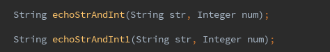
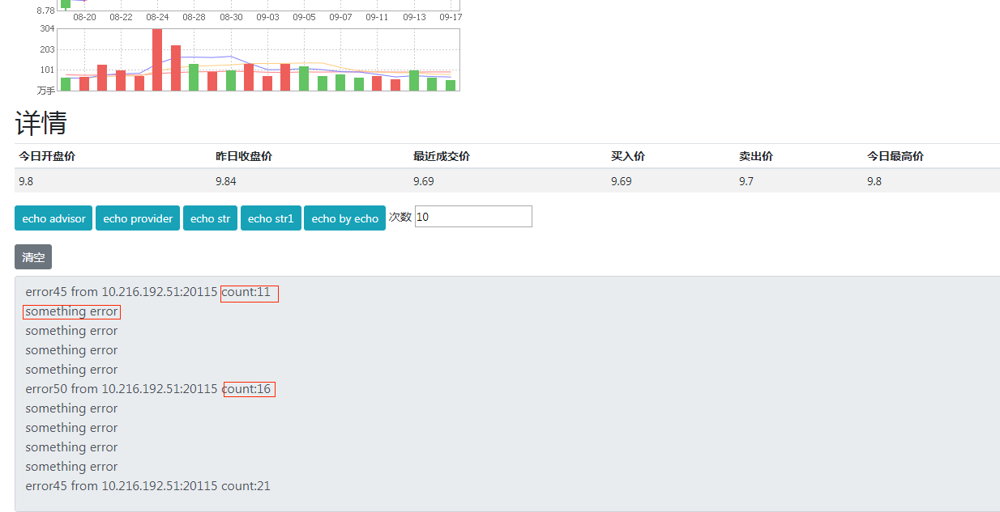

### NSF-SAMPLE(DUBBO) 使用文档

#### 架构

架构非常简单，viewer调用wall，wall调用 echo。三者调用全都基于dubbo协议。

#### 使用方式

注意：由于完整部署需要多个demo支持，为了方便，只部署dubbo相关的应用，因此下图中的部分数据可能没有，比如股票列表、热门股票推荐、股票详情。

使用dubbo应用前先确保右上角开关为Dubbo On状态。我们主要需要关注的是图中的1号接口echo str和2号接口echo str1。对应下图的两个方法，方法都有两个参数，一个string，一个integer。

当调用echo str接口的时候，viewer会发请求给wall，wall再发请求给echo，在控制台能看到echo返回的数据。

上图是调用十一次，控制台显示的echo返回信息。其中test+数字(45-54)，test为调用的接口的第一个参数，数字为第二个参数，from后面写的是echo自身的ip。利用这个接口，可以测试负载均衡、路由、参数分流规则。test+数字主要是为参数分流服务的，比如配置参数分流的参数取模时，参数序号写0就对应test这个参数，写1就对应后面的数字，数字会从45一直递增到54，然后再回到45，方便测试。

echo str1接口也非常相似，但是增加了一点东西。

上图调用了echo str1接口11次，echo str1接口的第一个参数值是error，第二个参数为数字(同样从45-54)。每调用五次，仅会成功一次，剩下的四次都会报错。这个设计是为了测试容错，当同服务重试次数设置4次以上，且启用规则后，将不会返回something error，而是遇到异常继续重试，直到成功或达到重试次数上限。

建议规则建在wall下进行测试，比如wall路由至echo,wall负载均衡至echo,wall参数分流至echo。像限流、熔断等规则的测试，在启用规则后，可通过日志是否有输出来判断规则是否生效。比如限流后，达到一定的次数，日志将不会输出，停用规则后，日志继续输出。

